# CI/CD Tutorial(Huawei Cloud)

## 0. Overview

这是一份为软院SE2320课程（互联网产品设计与开发）编写的华为云CI/CD配置教程，记录了我配置华为云流水线的过程和踩过的一些坑。

从个人的观感上来说，华为云的CI/CD是真的很难用...不仅有一堆奇奇怪怪的图形化界面，还有各种错综复杂的页面跳转关系，以及非常坑爹的、问你要下载链接(`package_url`)的部署任务配置。这些东西单独拎出来就有点难以让人接受了，放在一起的时候更是让人摸不着头脑，让满心欢喜来配置CI/CD的你不仅没能成功，还浪费了大把时间，甚至最后发现手动编译、测试和部署更简单更节省时间，以至于开始怀疑CI/CD的意义。

但实际上CI/CD并非如此难用。Github和开源的GitLab大多数时候只需按照步骤编写一个yaml文件就可以使用CI/CD功能，而且有种类多样、功能丰富的插件仓库可以使用，没有让人眼花缭乱的界面、跳转关系、制品仓库。从使用者体验和初学者学习的角度来看，我个人强烈推荐使用Github和GitLab的CI/CD功能，而非华为云。当然，如果要从国产化等政治角度来看的话，当我没说...

希望这份教程能帮到挣扎在华为云CI/CD中的你！

## 1. 集群设置

我们需要为CI/CD配置一个集群用于部署流水线生成的包，按照如下步骤进行：

1. 进入“设置-通用设置-基础资源管理“，新建主机集群

2. 添加或导入已购买的主机（就是买的ECS，在跳出来的界面配置好端口和密码即可）

## 2. 流水线创建

“流水线”即为华为云CI/CD的主要部分，在这一个组件中，我们可以定义从编译、测试到发布的各个过程。**需要注意的是编译和发布任务需要分别在“编译构建”和“部署”中定义好之后才能在“流水线”中使用**。

1. 新建流水线

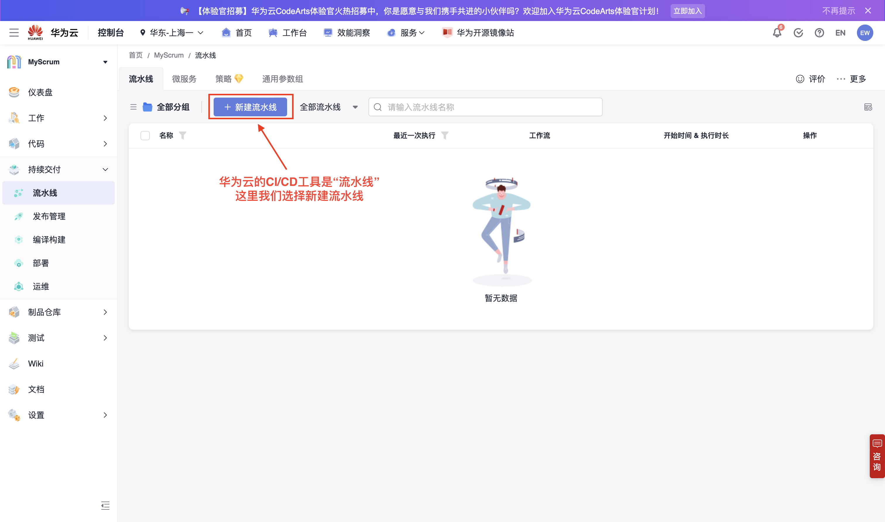

2. 选择构建模版

我用Java写了一个简单的Helloworld Server，使用的是Springboot框架，用Maven构建。因此，在这里我选择使用Maven构建

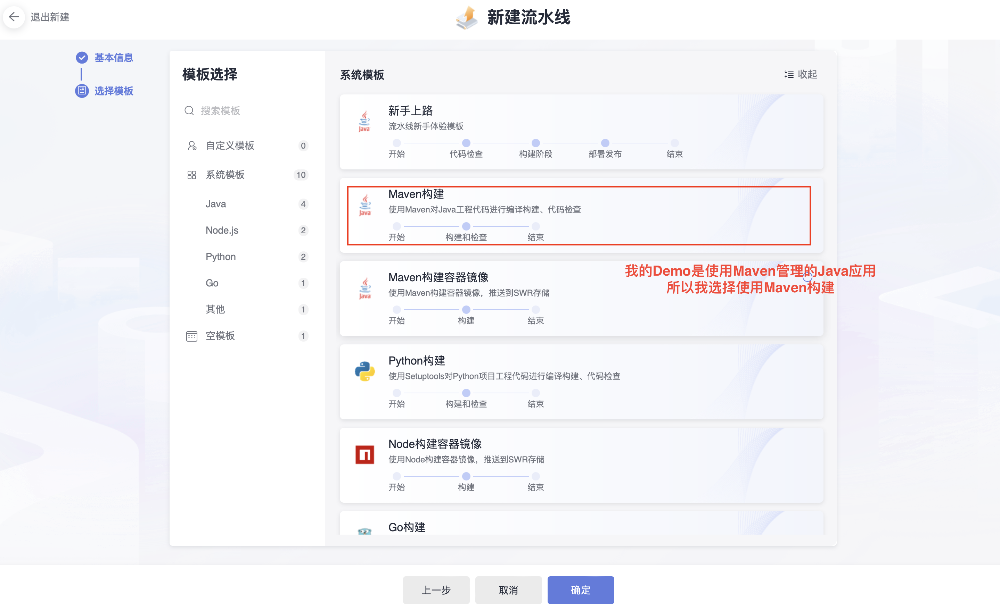

创建好之后新增一个部署任务，最终我的CI/CD Workflow如下：

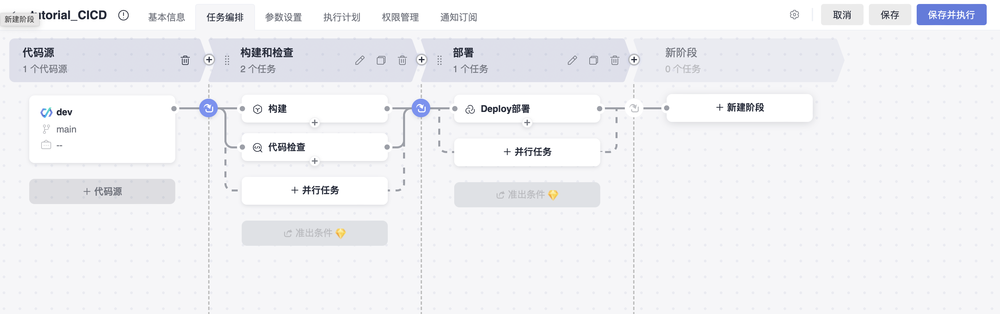

3. 定义各个任务

构建任务：具体的业务逻辑需要在“编译构建”中定义，这里我们在构建任务中引用我们创建好的`build-maven`任务，指定好代码仓库。`build-maven`任务的配置过程我们会在[编译构建章节](#3-编译构建)中详细阐述

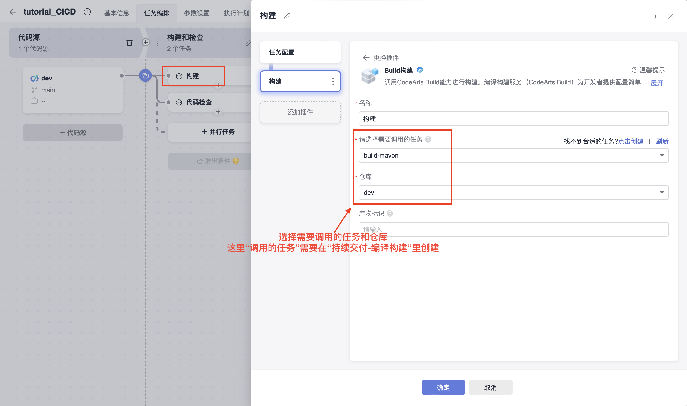

代码检测任务(Optional)：直接配置即可

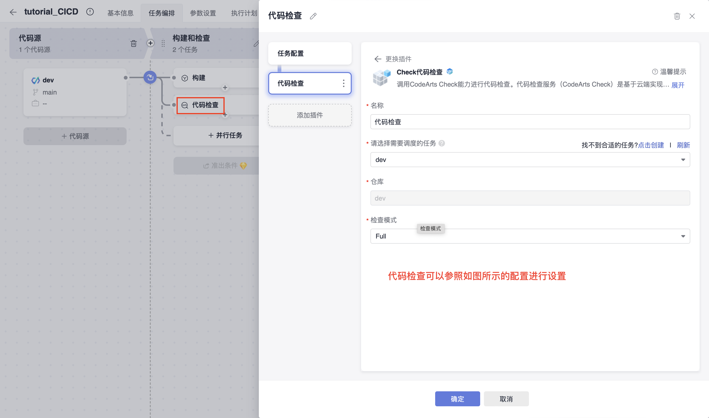

部署任务：具体的业务逻辑需要在“部署”中定义，这里我们在"Deploy部署"任务中引用我们创建好的`deploy-helloworld`任务，并把"Deploy部署“任务关联到之前的“构建”任务中。中间从`host_group`到`package_name`的一些参数是我们在后续部署过程中需要用到的，具体含义如图所示。在[部署章节](#4-部署)中我们会详细阐述`deploy-helloworld`的配置过程和图中这些参数的含义。

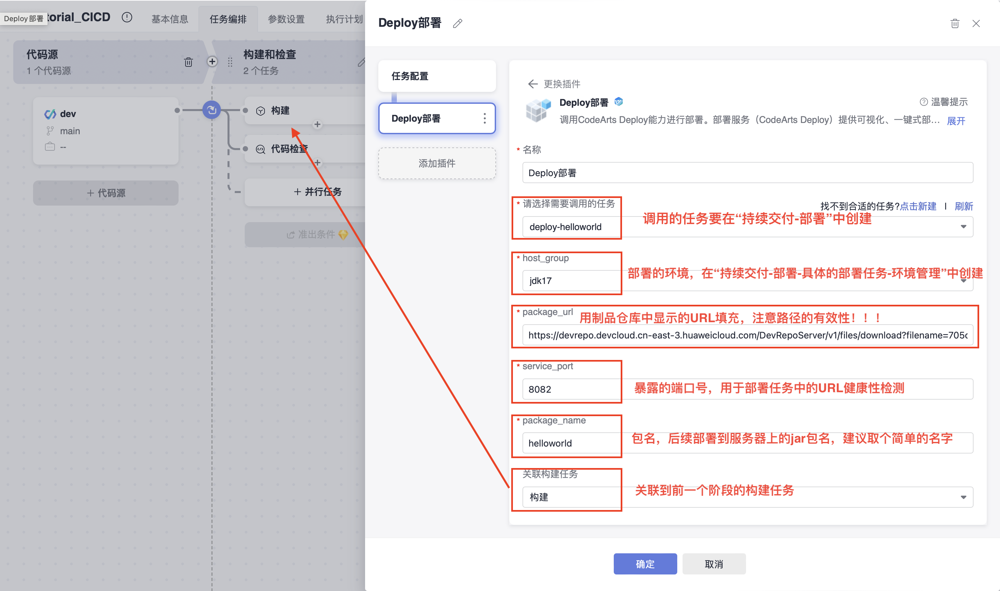

## 3. 编译构建

在这一步中我们需要完成项目的编译构建以及单元测试的运行，按以下步骤进行：

1. 新建构建任务，给任务取个好听的名字，设置好仓库名和默认分支

2. 选择一个模版（我选的是maven模版）

3. 构建环境配置&代码下载配置

在选择模版并确定后会出现如下界面，其中前两项的配置较为简单，直接使用默认配置即可

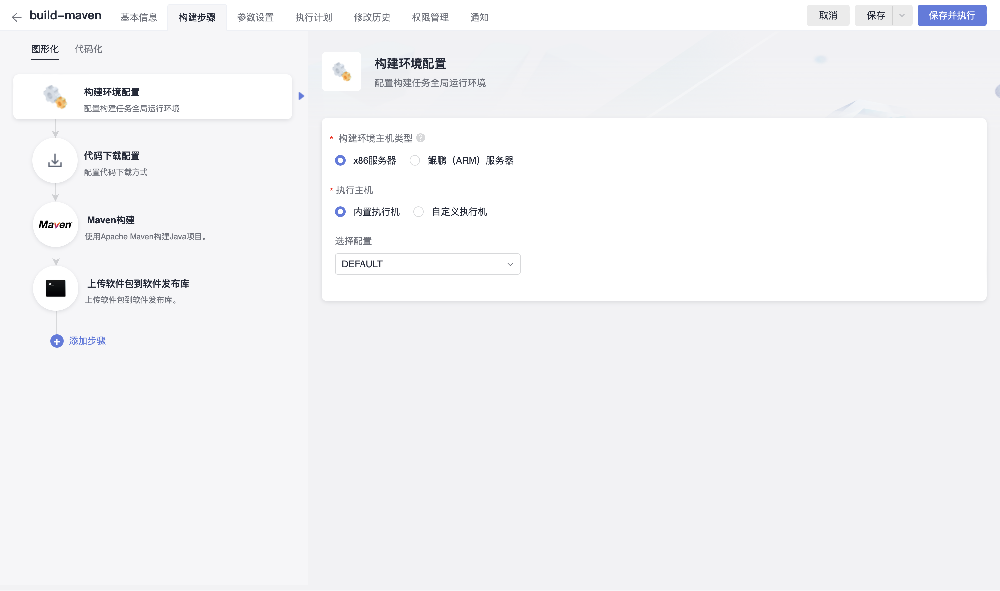

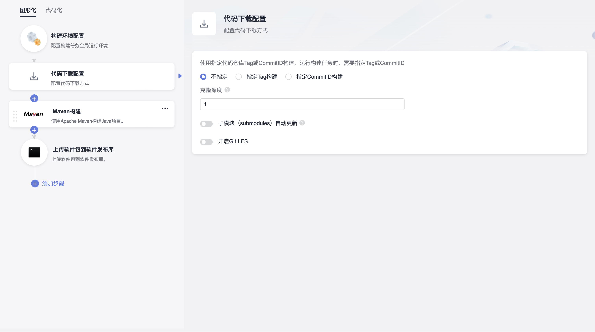

4. Maven构建

这一步需要指定使用的Maven工具的版本和运行的构建指令，需要参考具体的项目Maven版本来指定配置

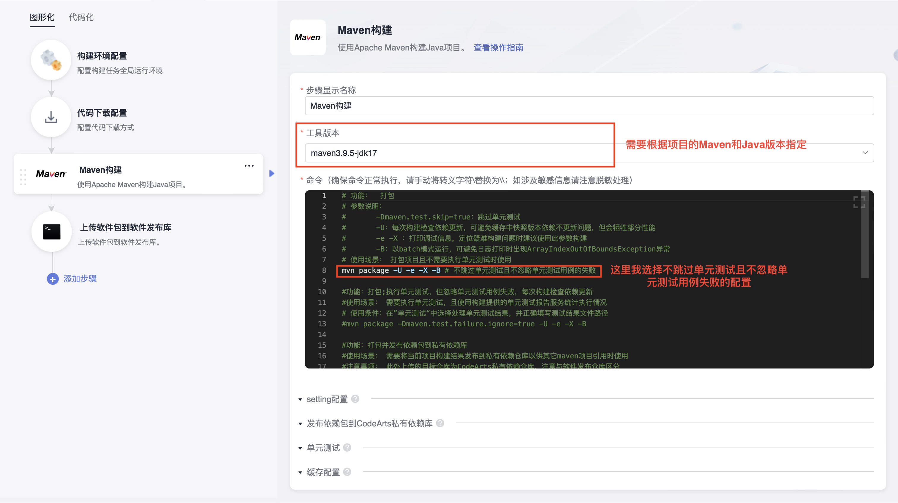

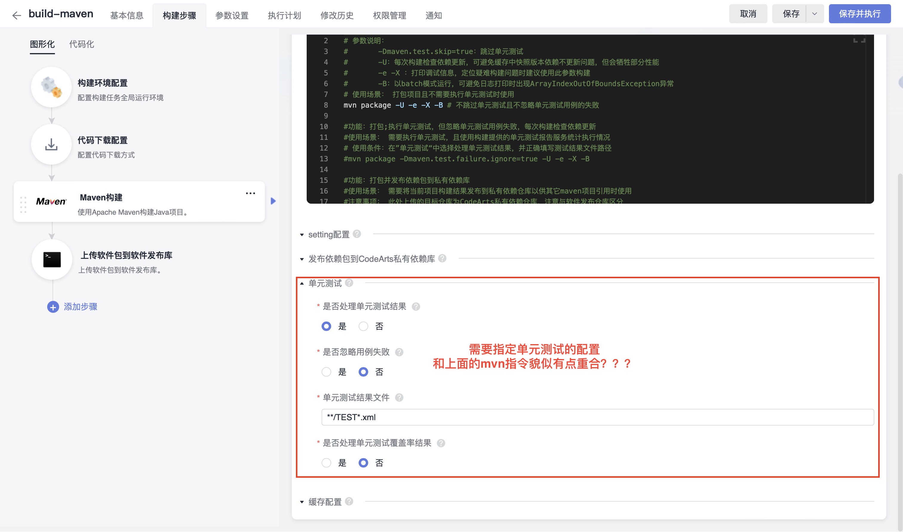

5. 上传软件包到软件发布库

由于Demo项目是的是Maven构建的Springboot项目，因此构建包的路径我使用了默认的`**/target/*.?ar`

同时在这里我们需要指定发布版本号和包名，**这两个参数决定了编译出来的包在制品仓库中存储的位置**，默认值分别为构建序列号和原始包名。一个问题是构建序列号和原始包名会改变，这会给下一步的部署任务下载包带来困难（下载的URL会改变），因此我直接指定了版本号和包名，以确保制品仓库中编译好的包路径不会改变。

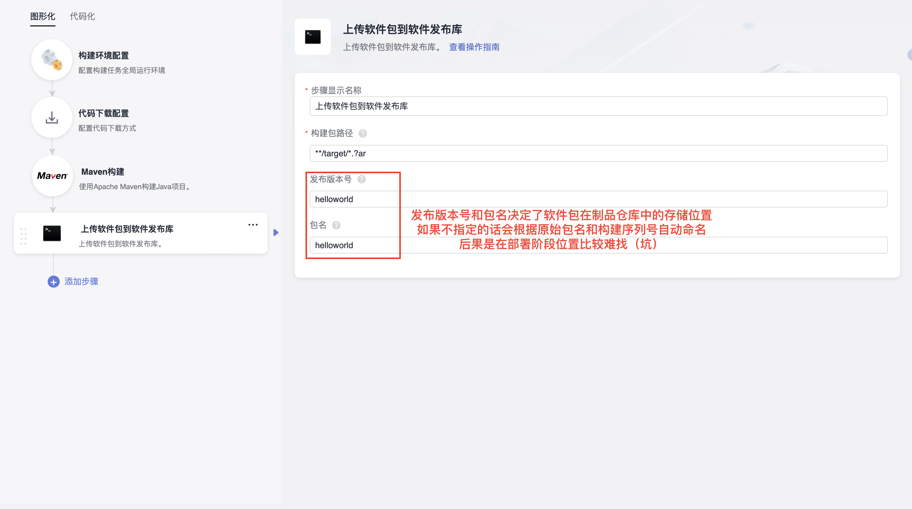

6. 编译构建结果

如果编译构建成功通过，构建任务会将编译好的包上传到制品仓库中，如图所示。

**流水线中"Deploy部署"任务中的`package_url`参数即为图中所示的下载链接**。如果没有指定发布版本号和包名，这个下载地址就会发生变化。

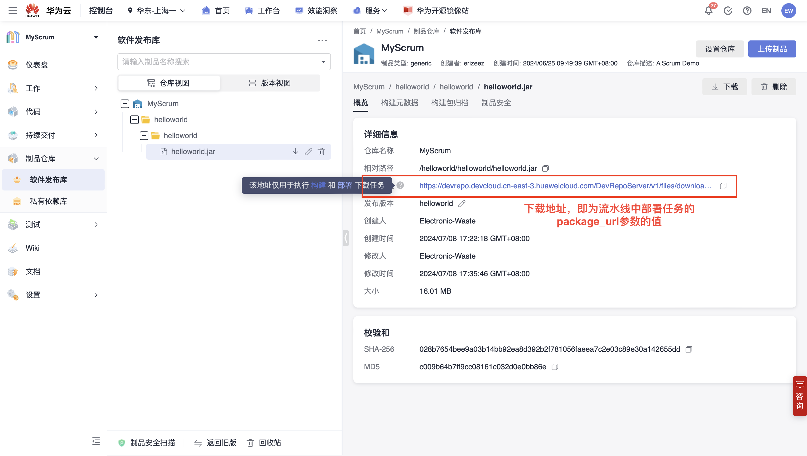

## 4. 部署

在这一步中我们需要完成编译构建生成产物的部署工作，按照以下步骤进行：

1. 新建部署任务，给任务取个好听的名字

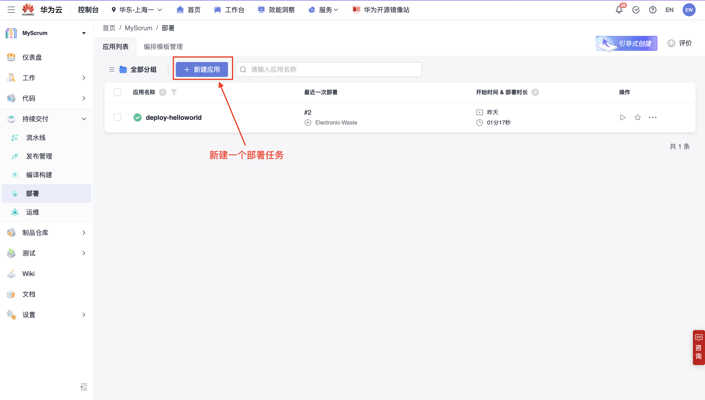

2. 选择部署任务的模版（我用的是Sprintboot）

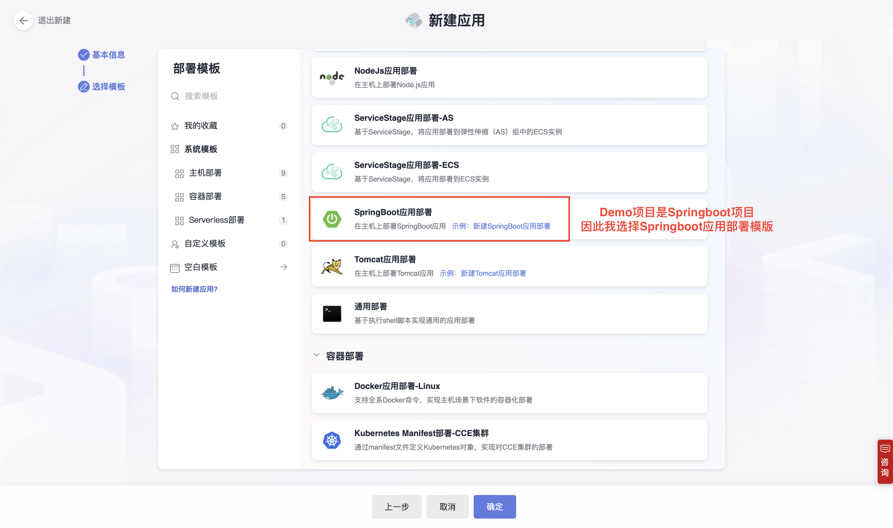

3. 完成“安装JDK”配置

“环境”项需要我们去新建，**在新建之前请确保完成了[集群设置](#1-集群设置)**，在新建完之后选择项目运行的环境。

JDK版本需要根据具体的项目版本去选择，我用的是Java17，所以选择了openjdk-17，安装路径选择默认即可。

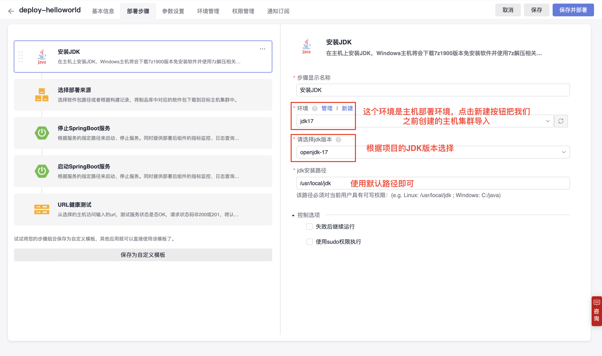

4. 新建环境

在这一步中我们需要配置应用运行的环境，将我们此前配置的集群导入到环境中，用以支持部署任务。在部署完成之后，应用会在指定的主机集群上运行。

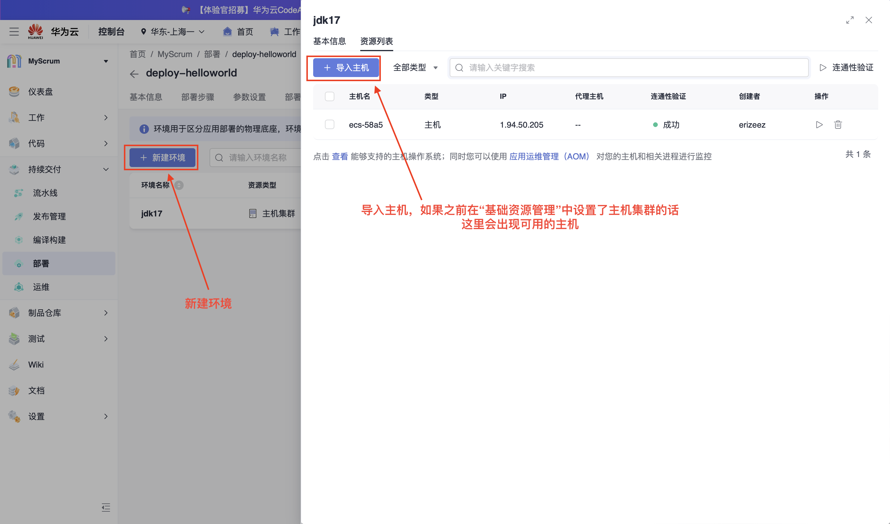

5. 完成“选择部署来源”配置

按照图示的方法去配置即可，其中“下载到主机的部署目录”项可以根据自己的实际情况进行修改。

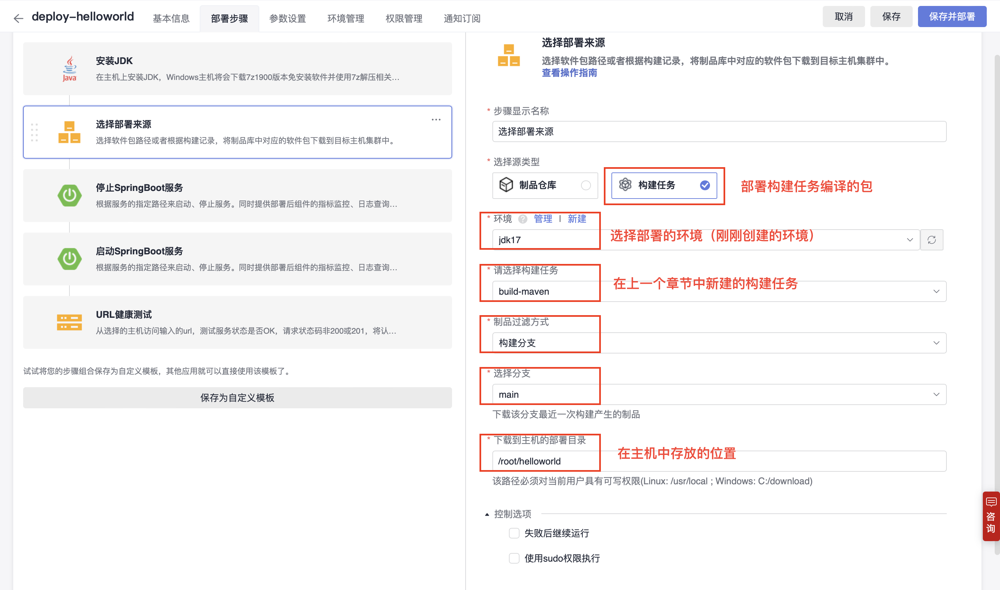

6. 完成“停止SprintBoot服务”配置

环境我们选择刚刚创建的那个环境，服务对应的绝对路径应该是：上一步的“下载到主机的部署目录”+包名（包名可以通过`${package_name}`来替换）。**`package_name`就是我们在[流水线创建](#2-流水线创建)章节中"Deploy部署"任务中所需要指定的参数，也即我们在[编译构建](#3-编译构建)中“上传软件包到软件发布库”中所指定的包名**。

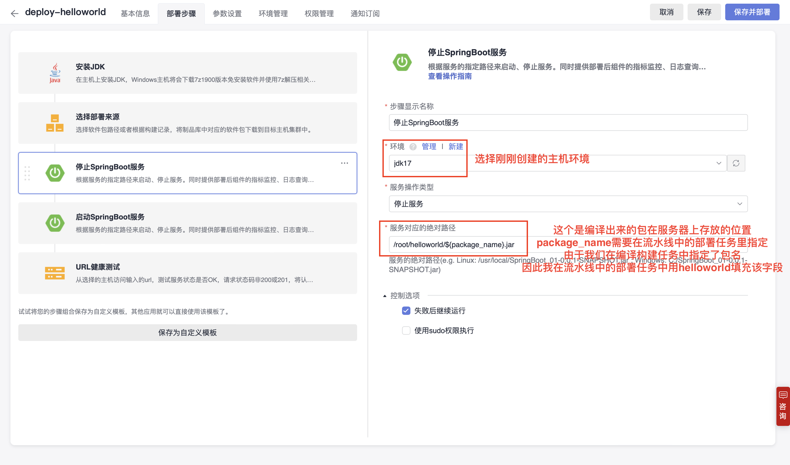

7. 完成“启动SpringBoot服务”配置

仿照上一小步的配置进行操作即可。

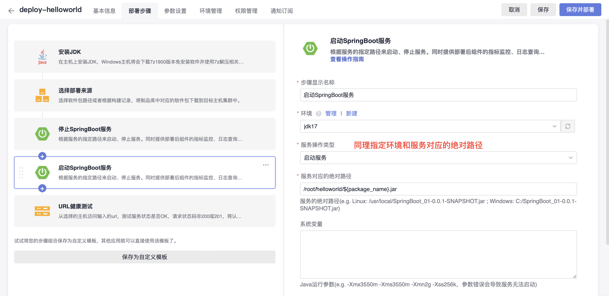

8. 完成“URL健康测试”配置(Optional)

可以暴露一个端口用于检测服务是否正常启动，在这里我暴露了`/hello/say`端口。**`service_port`就是我们在[流水线创建](#2-流水线创建)章节中"Deploy部署"任务中所需要指定的参数，也即我们在代码中指定的SprintBoot启动的端口**

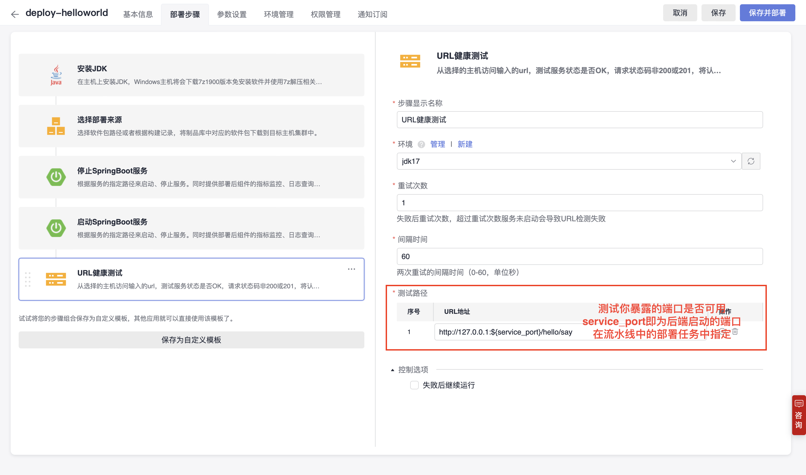

## 5. 大功告成🎉

点击运行流水线，等待执行完成后检查SpringBoot项目是否在服务器上启动。

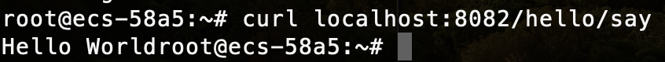

## 6. Q&A

> 欢迎提问！