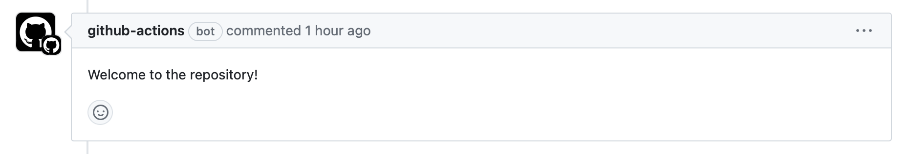

# CI/CD Tutorial

## 0. Overview for Github Actions

我把华为云上CI/CD的配置（吐槽）放在了[0_huawei_cloud](https://github.com/Electronic-Waste/cicd_tutorial/tree/0_huawei_cloud)分支下，如果不想看Github Action的话可以直接跳转到`0_huawei_cloud`分支下看华为云CI/CD的教程。

如果你是配置完华为云CI/CD才来看Github Actions的话，那么恭喜你，你会发现CI/CD竟然可以如此优雅和简单；如果你是一上来就看Github Actions的话，那么也恭喜你，你少走了几十年的弯路。Github Actions和华为云CI/CD的最主要的区别是什么呢？我想应该是：

1. 简洁&方便：所有的工作流(Workflow)以代码的形式定义在项目的`.github/workflows`目录下，没有让人眼花缭乱的图形化界面，可以方便地在团队间共享和重用。

2. 功能强大&生态丰富：Github Actions提供了一个丰富的社区市场(Github Marketplace)，你可以在自己的Workflow中使用来自全世界的开发者发布的Action，去实现你自己的工作逻辑。

同生态的还有开源的GitLab平台，CI/CD同样十分好用，选了系统软件方向的同学在下个学期做编译Lab的时候会接触到GitLab的CI/CD功能（虽然是TA们写好的，你并不能直接修改）。

介绍几个简单的概念（复制粘贴自官方文档）：

1. **Github Actions**: 使用GitHub Actions几乎可以帮您自动化软件开发流程中的方方面面。包括自动化测试、CI/CD持续部署、自动化代码审查、管理问题和拉取请求，等等。最棒的是，这些工作流配置以代码的形式保存在您的git仓库中，可以很方便的在团队之间共享和重用。

2. **工作流(Workflow)**: 工作流是一个可配置的自动化流程，它将运行一个或多个作业（task/job）。流程配置文件使用YAML格式，保存在仓库的`.github/workflows`文件夹中，只有所选事件发生时，才会触发执行。

3. **作业(Job)**：作业是工作流中在同一运行器上（runner）执行的一组步骤。一个工作流可以包含多个作业，一个作业由多个步骤组成，步骤按顺序执行并且相互依赖。

4. **步骤(Steps)**：Actions steps将在我们的作业运行期间按顺序运行。每个步骤要么是一段将要执行的shell脚本，要么别人编写好的GitHub Action。它们按顺序执行，并且相互依赖。由于每个步骤都在同一运行器上执行，因此你可以将数据从一个步骤共享到另一个步骤。例如，可以有一个生成应用程序的步骤，后跟一个测试已生成应用程序的步骤。

下面让我们通过几个例子上手实操一下功能强大的Github Actions吧！

## 1. Welcome to Github Actions

本例子搬运修改自[Github中文社区教程](https://www.github-zh.com/getting-started/hello-github-actions)。在这个例子中我们要让Github Actions评论每一个向`1_github_actions_welcome`分支发起的PRs。以下是这个例子的Workflow YAML文件，通过这个例子我们可以简单了解一下Workflow YAML文件的编写方式。

```YAML
# name表示这个Workflow的名字是...
name: Welcome to Github Actions 

# on表示在某些事件发生的情况下触发该Workflow
# pull_request：向该分支发送PR的事件，其它常见的事件还有push(向远端推送代码)、schedule(定时执行)
# branches：指定能触发事件的代码分支
on: 
  pull_request:
    branches:
    - 1_github_actions_welcome

# permissions声明了该Workflow需要用到的权限
# pull-requests: write 表示我们为该Workflow赋予了写权限
# Workflow默认使用的ITHUB_TOKEN没有写权限，需要在"Settings-Actions-General"中打开Workflow的write权限
permissions:
  pull-requests: write

# jobs表示具体要执行的一个或多个任务(Job)
# welcome：定义了一个Job，可以随便取
# name：welcome Job的名称
# runs-on：指定了Job运行的环境，Github提供了Ubuntu, Windows和MacOS运行器来运行Job
# steps：Job中的顺序执行的步骤，下方表示一个名叫"Comment"的step要执行`gh pr comment`命令
# env：指定在Job中用到的环境变量，例如下方的PR_URL，其值为该PR的链接
# 在使用Github CLI的时候需要在环境变量中传入GITHUB_TOKEN
jobs:
  welcome:
    name: Welcome to Github Actions
    runs-on: ubuntu-22.04
    steps:
    - name: Comment
      run: gh pr comment $PR_URL --body "Welcome to the repository!"
    env:
      GITHUB_TOKEN: ${{ secrets.GITHUB_TOKEN }}
      PR_URL: ${{ github.event.pull_request.html_url }}
```

需要注意的是**Github仅识别default branch下的`.github/workflows`文件夹，因此你需要在default branch中存放所有的Workflow YAML文件**。

你可以通过向`1_github_actions_welcome`分支发起PR来进行测试，不出意外的话会出现：



## 2. Unit Test

通过[上面的例子](#1-welcome-to-github-actions)，我们初步上手了Github Actions，并对Workflow、Job、Steps等概念有了一个大概的了解。但这远远不够，Github Actions其它的一些强大功能还没有被我们发掘出来，比如**Github Actions强大的Marketplace**。Marketplace不仅有Github官方发布的一些通用Actions，还有来自全世界各地的开发者贡献的Actions，它们共同实现了Github Actions生态的繁荣。接下来，我们将通过下面的例子更深入地了解Github Actions吧。

在这个例子中，我们将配置好Java环境，并对Java Helloworld项目进行单元测试（虽然我并没有写测试集）。你将直观地感受到Github Actions功能的强大。


\#WIP